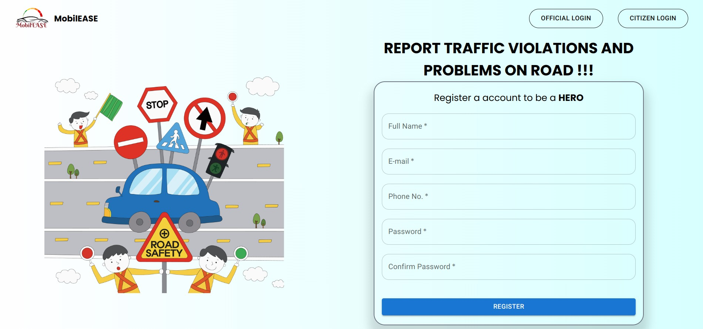
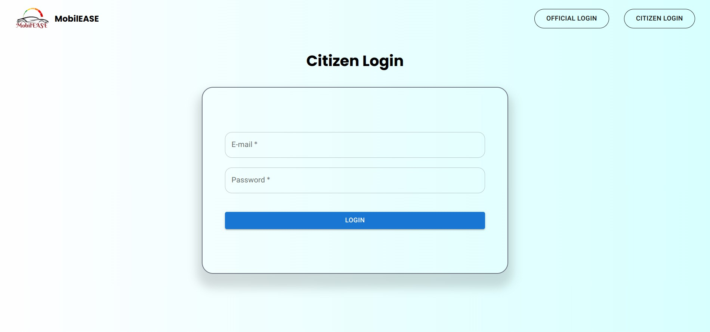
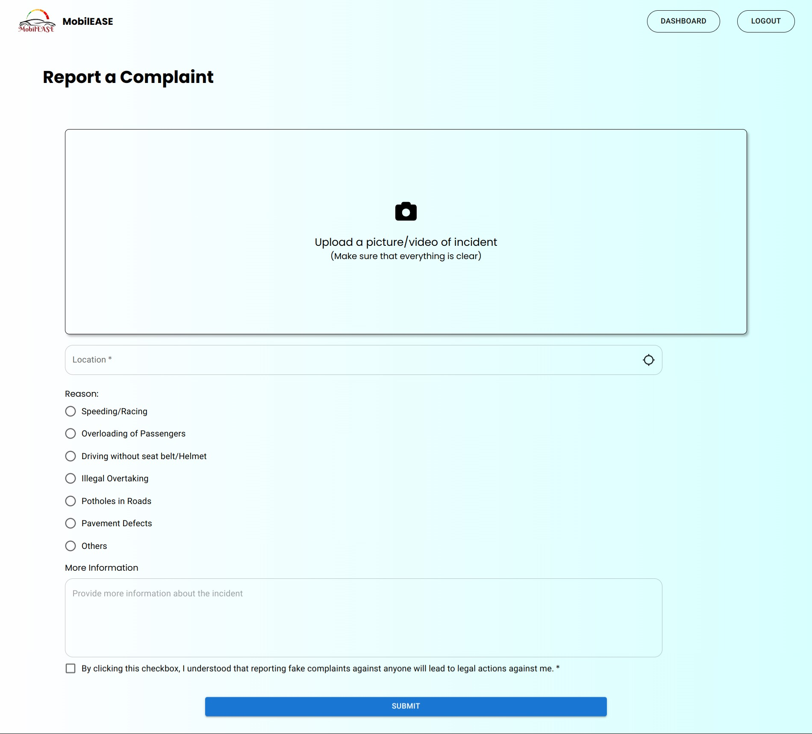
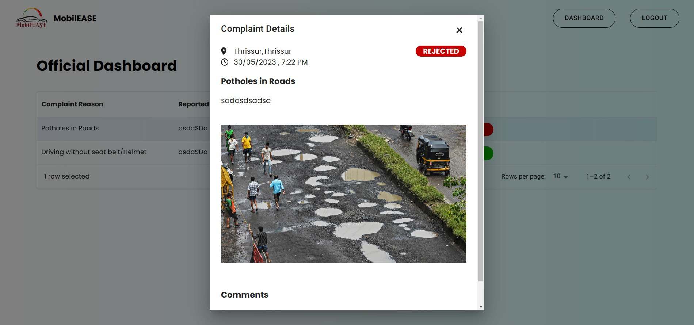
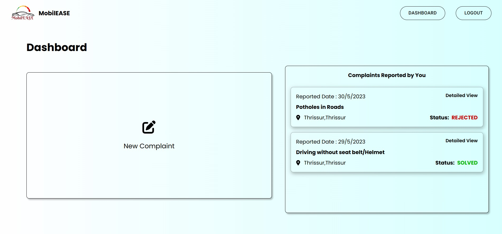

# MobilEASE


> A Web-Based Traffic Complaint System that can be used by citizens for reporting various traffic and civic issues.

## Background / Problem Statement

The problem addressed by the MobilEASE is the prevalence of traffic chaos in urban areas due to a lack of efficient means for citizens to report incidents. The current system of reporting traffic incidents is often cumbersome, time-consuming, and ineffective, resulting in delayed resolution and increased frustration among citizens. This has led to a lack of accountability and transparency in governance and has negatively impacted the quality of life in cities. The proposed solution seeks to provide a user-friendly and convenient platform for citizens to report traffic incidents directly from their mobile devices. The system will utilize GPS technology to pinpoint the location of incidents and allow users to upload photos and videos as evidence, promoting a culture of civic responsibility
and collaboration.

## Features

- Two types of users - citizen and official
- Progressive Web App (PWA)
- Completely Mobile Responsive
- Only citizen users can be created using the webpage, official credentials are given by admin
- Ability to attach video/image of the incident while reporting
- Ability to track reported complaints

## Screenshots

|  Home Page                   |  **Login Page**         |
| ------------------------------------------------------------------- | -------------------------------------------------------------- |
|  **Report Complaint Page**   |  **Official Dashboard** |
|  **Detailed Complaint View** |  **Citizen Dashboard**  |

## Languages, Frameworks, Tools used

- Figma for designing
- Vite + ReactJS
- Firebase as database (Firestore) and cloud storage
- Tailwind CSS for styling
- Material UI (MUI) for some components (Dialog, DataGrid, etc.)

## Developing

- Clone the repository
```shell
$ git clone https://github.com/vivekkj123/mobileEASE.git
```
- Install all dependencies

```shell
$ cd mobileEASE
$ npm i
```
- Create a firebase project and create a .env file at your local directory containing configuration of that project.
(Refer env.example for the variable names)

- Run the server
    ```shell
    $ npm run dev
    ```

    The application will be running at `http://localhost:5173`

## Contributing

This project is created as part of our semester 4 project exhibition. If you are inspired and too enthusiastic about this web application, feel free to ping me on any social medias before making any changes.

## License

MIT
